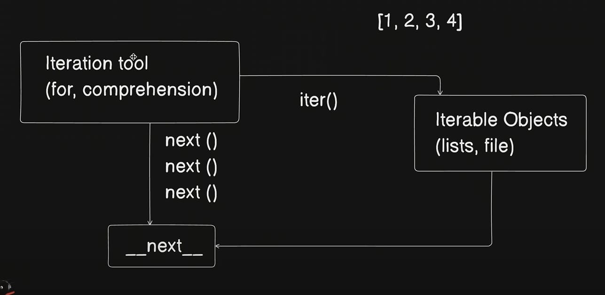

# Internal Working:
There are some steps that python follow while executing the code

## Python VM: 
when we install python we got python virtual machine with that, it helps us to execute our file or program

## Steps for executing a program:
- Compiled to byte code (byte code in platform independent)
    - Byte code runs faster
    .pyc -> compiled python (frozen binaries)
    __ pycache __ (it can track the changes made in .pyc it is made by python cause the acutal file is not getting affected)
        - Source change & Python Version
          filename.cpython-312.pyc(cpython is standard type of python and 3.12 is the version of python, this file track the changes in our code)
        - works only for imported files
        - not for top level files
    - PVM(Python Virtual Machine):
        - code loop to iterate byte code
        - Run time Engine
        - Also known as python interpreter
    - Byte code is not Machine Code
        - Python specific interpretation
        - cpython(Standard implementation), jPython, IronPython, Stackless, PyPy


# Behind the scenes in memory python:
In python, there is no data type to the reference but in the actual memory there is datatype reference.

## For Example:
```
a = 5
```
In this case 5 is integer but the reference of 5, 'a' has no datatype.

## Internal Reference:
There is a method called ref_count() which works behind the scene which counts the number of reference of an object.But we have a library named sys by that we also have a reference count method. But it is not like that


It will always show the number by the work of behind the scene

- [ ] In cae of number and string the garbage collector will work lately for sometimes it will store the refernce


Here we pass a copy not the actual refrence by slicing

# Python Loops behind the scene:

  
    At first the iter tools approach the objects with the __iter()__ method then the object returns a __next()__ which returns if there is any other element or not, __next()__ will return that much times how much elements are there and when we comes to the end of the iterable object the it will throw __StopIterationException__ then it will stop.

## - In case of file:
```
f = open('Filter.py')
f.readline()
```
read the lines of the file one by one how many times we run __f.readline()__
- Another way:
```
f = open('Filter.py')
f.__next__()
```
In this case we got the accurate exception not the empty string

## - We can use Loop:
```
    for line in open('Filter.py'):
        print(line, end='')
```

```
    f = open('Filter.py')
    while True:
        line = f.readline()
        if not line: break
        print(line, end='')
```

## - Using List:
```
    myList = [1,2,3,4,5]
    I = iter(myList)
    print(I.__next__())
```

## File using iter():
```
    f = open('Filter.py')
    iter(f) is f #returns true
    iter(f) is f.__iter__() #returns true
```

## List Using iter():
```
    myList = [1,2,3]
    iter(myList) is myList #False
```

## Dictionary using iter():
```
    D = {'a':1, 'b':2}
    I = iter(D)
    print(i) #prints the pointing address
    print(next(I)) # 'a'
    print(next(I)) # 'b'
    print(next(I)) # StopIteration
```

## Range:
```
    R = range(5)
    I = iter(R)
    print(next(I)) #0
    print(next(I)) #1
    print(next(I)) #2
    print(next(I)) #3
    print(next(I)) #4
    print(next(I)) #StopIteration
```